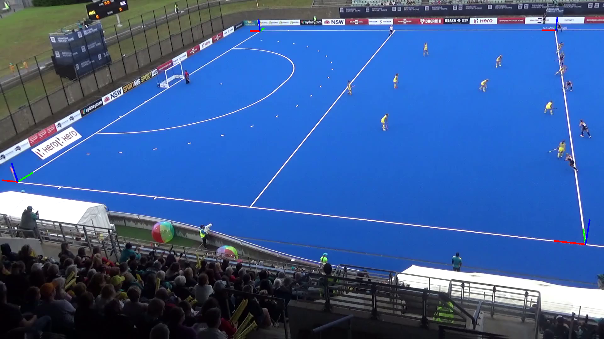
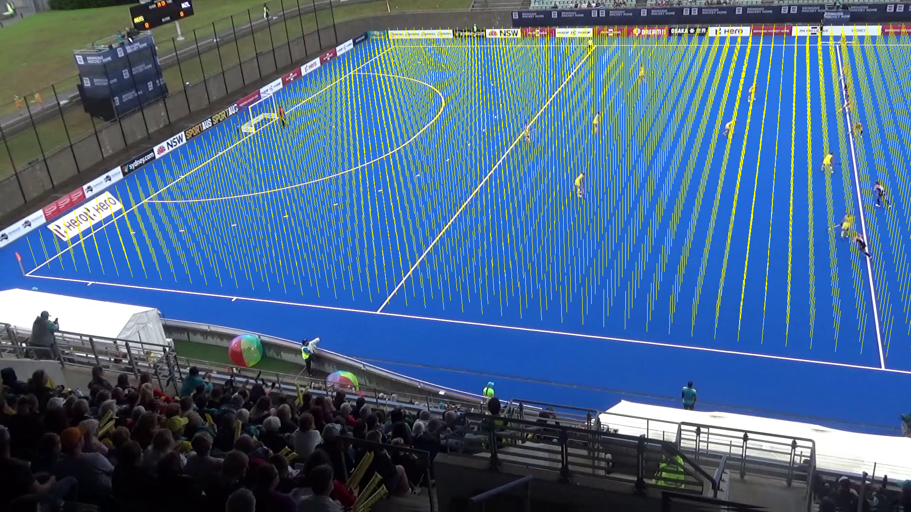

# CameraKit
A generic toolkit for camera control and camera-world models.

Essential parts of the image calibration routines used in [VisionKit 2.0](git@github.com:ausport/visionkit.git "VisionKit 2.0 Github repository").

Interface to support:
* Image to model correspondences
* Image to model warping
* Estimate camera extrinsics
* Perspective-free image crops.

### CameraKit Modules

#### VKCamera:

Cameras can be instantiated using device-specific `VKCamera` subclasses.  

Details on usage [here](cameras/README.md).


#### VKWorldModel:

World models provides the coordinate translations between image and world spaces.

World models are typically used as a property of a device-specific `VKCamera` class.






## Installation Notes:


### BlackMagic BRAW API

[Aiden Nibali](https://github.com/anibali/pybraw) has developed a set of python wrappers exposing the important functions in the BlackMagic API.

He recommends setting up a Conda environment - follow his instructions if you prefer a Conda.

Alternately, you can install the pybraw package in a pip environment (preserving the Vimba SDK requirements).

You will need to copy all of the Blackmagic libraries to somewhere accessible..  eg.

```commandline
cd [path_to_downloaded_libraries]/BlackmagicRAW/BlackmagicRawAPI/
sudo cp *.* /usr/lib/x86_64-linux-gnu/
```

Clone the pybraw package from Aiden's github repository:

```commandline
git clone https://github.com/anibali/pybraw
```
Activate the pip venv, and navigate to the cloned repository.

Install the pybraw package:

```commandline
pip install --no-build-isolation -U .
```

Test the package has installed correctly:

```python
from pybraw import PixelFormat, ResolutionScale
from pybraw.torch.reader import FrameImageReader
file_name = [path_to_sample_footage]
reader = FrameImageReader(file_name, processing_device='cuda')
# Get the number of frames in the video.
frame_count = reader.frame_count()
print(frame_count)
```
*Note that the requirements for pybraw can be quite tricky, so it is a good idea to install this first, ensuring that
it is installed in the conda env.*
### Vimba SDK

If using the Vimba cameras, the Vimba SDK (see below) is required to install `vimbapython`.  This requires a python version with pip support.

Follow the [instructions](https://cdn.alliedvision.com/fileadmin/content/documents/products/software/software/Vimba/appnote/Vimba_installation_under_Linux.pdf) 
provided by Allied Vision to install the Vimba libraries and configuration.

From the `source` folder in the `VimbaPython` directory supplied in the SDK, execute:

```commandline
python -m pip install .
```

A further note - the pip install for `PyQt5` is not compatible with the typical `opencv-python`, since the pip installation
of the latter installs it's own Qt libraries by default (for Linux, but not for OSX).  The easiest workaround here is to
install `opencv-python-headless`, which doesn't install Qt overheads, and avoids this conflict.

On occasion, depending on the order of dependency installation, the following error can occur mixing the pip version of PyQt5, and OpenCV.

```bash
qt.qpa.plugin: Could not load the Qt platform plugin "xcb" in "" even though it was found.

This application failed to start because no Qt platform plugin could be initialized. 
Reinstalling the application may fix this problem.
```

Resolve this by re-installing `xcb`:

```commandline
sudo apt install libxcb-xinerama0 
```
