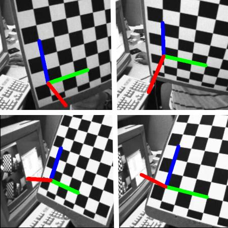

# One Man Band Algorithm:

The underpinning logic for OMB depends on estimating the *pose* of the 
camera in relation to the area of interest.

Invariably, we are interested in the camera pose relative to the court or pitch.

OpenCV provide a checkerboard calibration routine that uses `cv::solvePnP` 
to estimate the camera rotation and translation vectors.

We approximate the same method by substituting features of the checkerboard with 
the geometric orientation of image-world correspondences 
derived from the calibrated surface models.

Each camera instance (subclassed instances of [`cameras/camera_base.py`](./camera_base.py))
should be initialised using `estimate_camera_extrinsics(camera_points, world_points)`
where the `camera_points` and `world_points` correspondences have been manually assembled (using the linked camera calibration interface).

`estimate_camera_extrinsics(camera_points, world_points)` passes the image-world correspondences
 and the camera intrinsics (e.g. focal length, and distortion) as 
inputs to the `cv::solvePnP()`function to estimate the camera extrinsics 
(e.g. rotation and translation vectors).

The `estimate_camera_extrinsics(camera_points, world_points)` also populates
the `camera_pose` property, 

We make some broad assumptions that by projecting vertical lines (z-plane) into the camera space, 
and extending lines to an intersection, that point should roughly correspond to the relative
location of the camera in either image or world space.

| z-Plane Camera Projections             | Calibrated Camera Sample |
:-------------------------:|:-------------------------:
  | 

Once we have estimated the camera pose, the objective is to take any point on the 
playing surface, with a given field of view (FOV), and crop a region of interest.

Since our primary goal here is to mimic the behaviour of a human camera operator, we also
want to mimic the imagery that would be derived from a tightly cropped camera on a tilting
and rotating tripod.

The image below highlights a crop near the perimeter of a normal field of view in field hockey.

Note that the upright posts in the goal are skewed, due to the perspective in the camera view.

A normal panning crop would eliminate this because the FOV would be narrower.

We want the view of our virtual camera operator to be similarly free of this distortion.

Using the location of our camera pose (known in both image and model space),
we can transform the shape of the crop such that:
* The verticals align with the ray-points from the edge of the ROI to the theoretcial 
camera location,
* The horizontals are scaled by the user or by the algorithm to a span that 
includes all relevant playing features.

As an example of this, we can see the transformed crop bounds highlighted in red below.

The final step is to correct for the perspective and present the final cropped and
perspective aware image.

### Usage:

1. Instantiate a device-specific `VKCamera` class using the [`cameras/camera_base.py`](./camera_base.py)
base class.
2. Instantiate a sport-specific `VKWorldModel` class using the [`models/world_model.py`](./world_model.py) class.
3. Use the built-in camera-world correspondences interface to assemble an image to model homography.
This interface will update the `VKWorldModel` class which retains the model dimensions, parameters, with
both image and world correspondences.
4. Complete the camera initialisation pipeline by passing the updated `VKWorldModel` object to the `VKCamera` object using the 

